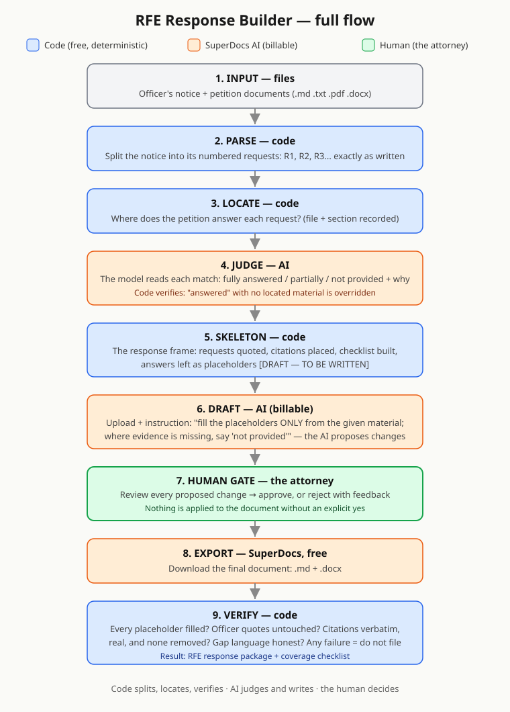

# RFE Response Builder

Officer's notice in — attorney-ready response package out.

When USCIS issues a Request for Evidence, an attorney has to answer every
concern in it, on a deadline, from a petition that may run hundreds of
pages. This tool reads the officer's notice, splits it into the individual
requests, finds the petition material that answers each one, and drives
SuperDocs to draft a response section per request — then stops at a human
review gate. Nothing is applied or exported until a person approves the
proposed changes, and the export is verified (quotes verbatim, citations
real and complete, evidence gaps stated honestly) before it is ever called
filed-ready.

Built for the SuperDocs engineering task. It is attorney-support drafting
software, not legal advice, and it never decides eligibility.



## Quick start (offline — no API key, spends nothing)

```bash
python3 -m venv .venv
.venv/bin/pip install -r requirements.txt
.venv/bin/python -m pytest tests/        # 127 tests, all offline
.venv/bin/python rfe.py preview          # parse + coverage checklist for the sample case
```

`preview` reads the bundled fictional H-1B case in `data/` and writes
`output/checklist.md` — one row per officer request, with the petition
sections it located and a coverage verdict.

## Two doors, one core

The same five operations are available two ways: a command line, and an
MCP server. Both call the same functions in `rfe.py`, so there is no
second implementation to drift.

| Operation | Command line | MCP tool | Bills |
|---|---|---|---|
| Is the key valid | `rfe.py check` | `check_key()` | no |
| Parse the notice, build the coverage checklist | `rfe.py preview` | `preview_case()` | no |
| Have the model judge coverage | `rfe.py judge` | `judge_coverage()` | yes |
| Upload and draft, then stop for review | `rfe.py draft` | `draft_response()` | yes |
| Carry the decision, export, verify | `rfe.py decide approve` (all or nothing) | `decide_changes()` (all, or change by change) | sometimes |

The steps are separate on purpose. `draft` stops at the proposed changes
and waits — nothing reaches the document until the next step carries an
explicit decision. That pause is the human gate, not an unfinished step.

The decision can also be made in the SuperDocs app's own Review view —
it is the same job. Run `decide` afterwards all the same: it sees the job
is already decided, skips the decision, and does the export and the
verification. Decide within about 20 minutes — SuperDocs lets proposed
changes expire unapproved after that, and the export then comes back
with its sections unwritten, which the verification reports.

### Door 1 — the command line

```bash
cp .env.example .env      # put your real key in .env — never commit it
.venv/bin/python rfe.py check             # key valid? (free)
.venv/bin/python rfe.py judge             # AI coverage judgement
.venv/bin/python rfe.py draft             # upload + draft, stops for review
.venv/bin/python rfe.py decide approve    # or reject; then export + verify
```

Run these one at a time.

### Door 2 — an MCP client

Register the server once, from the repo folder:

```bash
claude mcp add rfe-response-builder -- "$(pwd)/.venv/bin/python" "$(pwd)/mcp_server.py"
```

Or, for a client that reads a config file:

```json
{
  "mcpServers": {
    "rfe-response-builder": {
      "command": "/path/to/.venv/bin/python",
      "args": ["/path/to/mcp_server.py"]
    }
  }
}
```

Then ask the client to run the tools in the table above; call them one at
a time as well. Each takes an optional `case_dir` — a folder holding
`notice/` (one file) and `petition/` (the original petition documents).
Leave it out to use the bundled sample case. `decide_changes` takes
either `approve_all=true` or a per-change list, where feedback on a
single change makes the model re-propose just that one.

`MAX_OPS_PER_RUN` in `.env` (default 10) caps how many billable calls one
run may make — a run being the whole cycle from `draft` to the final
export. The count is saved in `output/run_state.json` between commands,
so `decide` carries on from where `draft` stopped. Once the cap is
reached, the run refuses the next billable call.

## What it does

- Parses the officer's notice into individual requests — across six
  layout styles and `.md`/`.txt`/`.pdf`/`.docx`.
- Locates petition material per request with deterministic, traceable
  word-overlap retrieval — every match can be traced to the words that
  produced it. Petition files in any other format are skipped, and the
  run lists them by name so nothing drops silently.
- Has the model judge coverage per request (answered / partially / not
  provided), then code verifies the judgement: an "answered" with no
  located material is overridden to "not provided".
- Builds the response skeleton in code — structure, officer quotes,
  citations, coverage table are deterministic; the model only writes
  prose into per-request placeholders.
- Stops at a human gate: proposed changes are written out for review;
  approve, reject, or reject-with-feedback (which makes the model
  re-propose; feedback through the MCP door) — over as many rounds as it
  takes.
- Verifies the export before calling it filed-ready: no surviving
  placeholders, officer quotes untouched, every request keeps its
  section, gap language present per unanswered request, every citation
  verbatim, from a real petition file, and none silently removed. The
  comparison is by words — the markdown syntax SuperDocs rewrites on
  export (code fences, backslash escapes, `<br>`) is not mistaken for a
  changed quote.

## SuperDocs surface

| Call | Used for | Billable |
|---|---|---|
| `POST /documents/upload-base64` | skeleton upload | no |
| `POST /attachments/upload-base64` | petition sources ride along | no |
| `POST /chat` | coverage judgement | flagged; observed charged 0 |
| `POST /chat/async` | drafting and re-drafting | yes |
| `GET /jobs/{id}` | polling the draft job | no |
| `POST /chat/{session}/approve` | the human decision | not flagged; a feedback round that redrafts may bill (see limitations) |
| `POST /documents/export` | markdown + docx out | no |

Both files are the same document exported by SuperDocs; the checks read
the Markdown copy.

## Evidence

| Claim | Proof |
|---|---|
| 127 automated tests, no key, no network | `.venv/bin/python -m pytest tests/` |
| Blind-tested on 9 unseen fictional cases (7 visa types, 7 notice layouts, 62 requests, independent answer keys) | `tests/blind/` |
| Dangerous misses ("answered" where evidence was missing): 1/62, caught by the human gate in review | blind protocol notes in `NOTES.md` |
| 5 parser defects found blind were fixed with regression tests | `tests/test_parse_notice_formats.py` |
| Full live run, hardest case (O-1A, 8 requests, PDF): first round invented wage data — the gate rejected it and export verification refused it; the corrected rerun passed through three review rounds | `NOTES.md` |
| Full live run through the MCP door on an unseen R-1 case, decisions made in the SuperDocs review UI | `NOTES.md` |

## Known limitations

- No OCR — scanned, image-only PDFs are refused, not read. Legacy `.doc`
  is not supported (`.docx` is).
- The last request ends at the first all-caps line (heading styles) or
  the first blank paragraph (list styles), so trailing text of the last
  request can be cut — check the last request's officer quote in the
  checklist.
- Very terse notices bias the locator toward "partially" — deliberately
  conservative: a false "partial" costs one extra look, a false
  "answered" gives false comfort before a legal deadline.
- On very large cases the coverage judge reads capped excerpts (the chat
  API's 100k-character message limit, discovered live).
- One active run at a time: drafting a second case while one is pending
  is refused with instructions, not queued.
- The operation counter is an estimate, not a bill. The drafting
  endpoint does not report what it charged, so the tool counts a minimum
  instead of the real number — check the SuperDocs Billing tab for the
  actual spend.

## Data & privacy

Everything in `data/`, `tests/`, and the sample outputs is fictional and
marked as such — invented people, employers, and filings, written for
this task. Real client documents must never enter this repository.

## Built by

Aditya Lingwal, for the SuperDocs engineering task.
